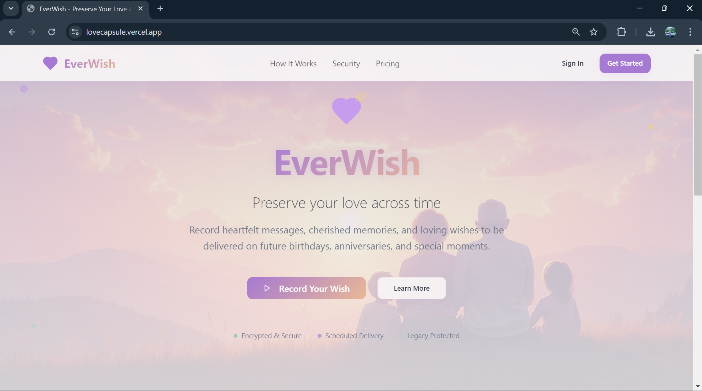
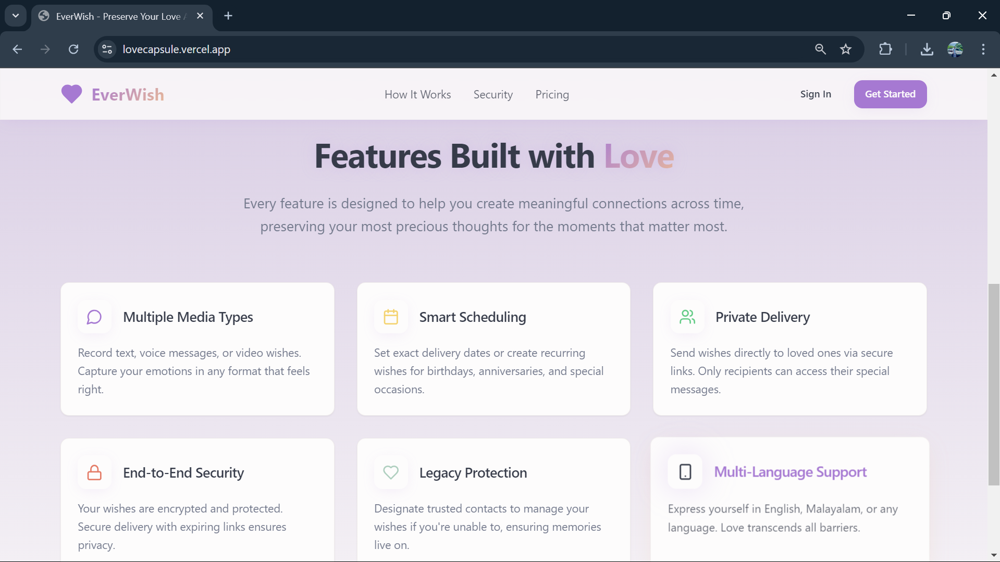
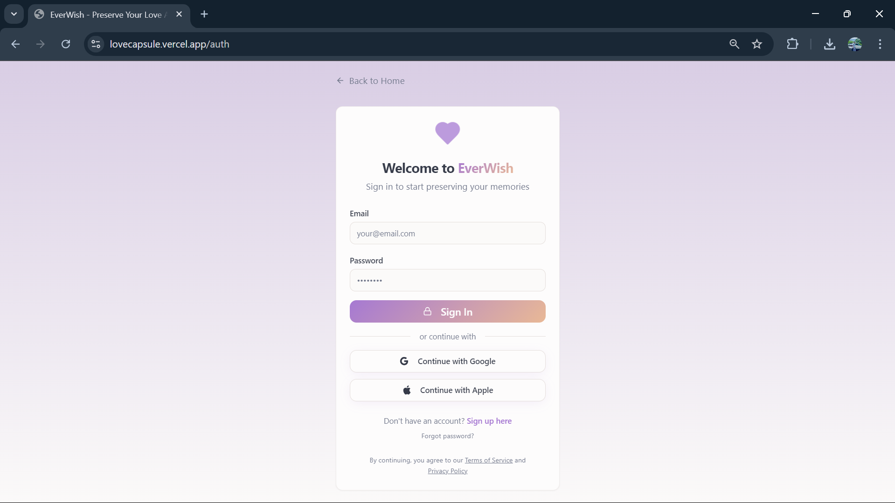
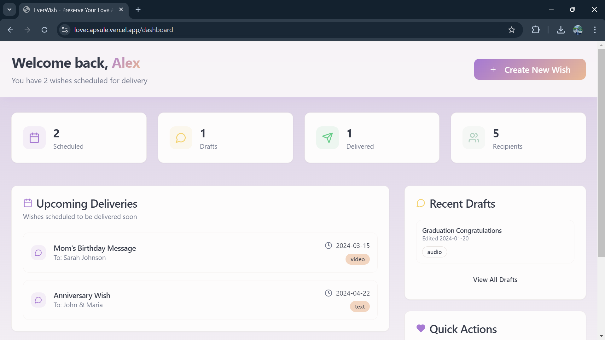
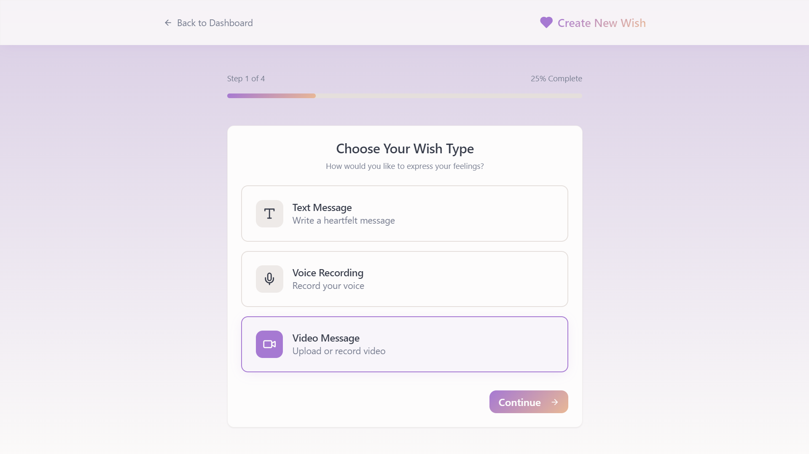
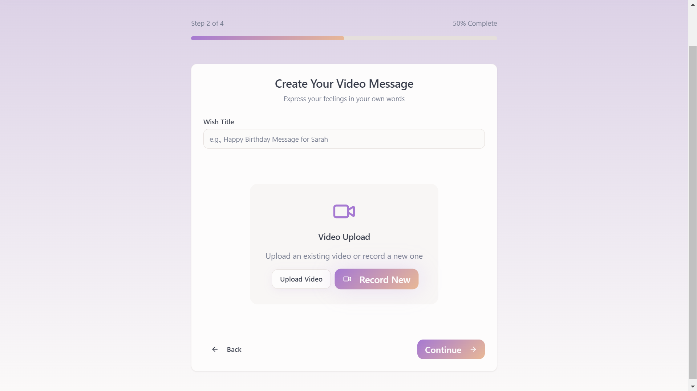
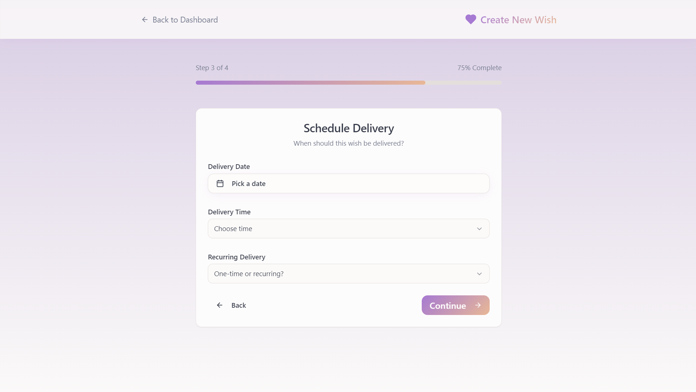
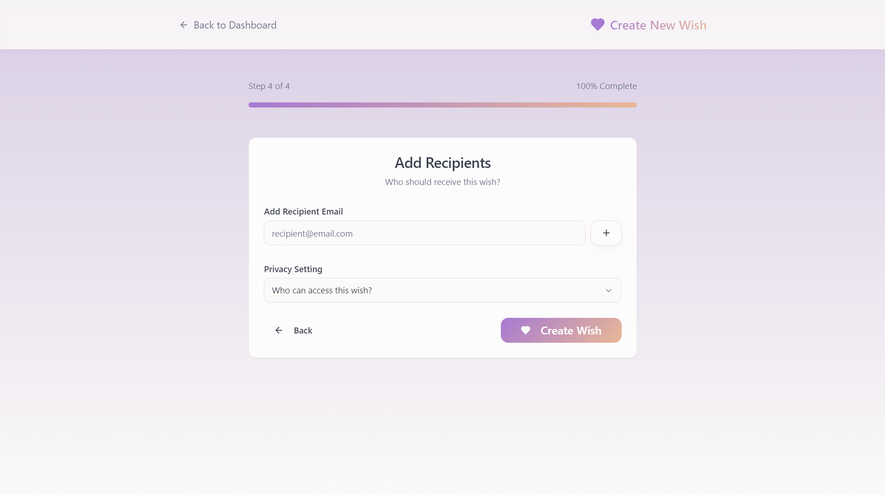

# 💌 LoveCapsule  

<p align="center">
  <a href="https://lovecapsule.vercel.app/" target="_blank">
    
  </a>
</p>

<p align="center">
  <b>Click the image above to try the Live Demo 🚀</b>
</p>


---

## 📌 About

**LoveCapsule** is a digital time-capsule web app that allows users to store and schedule delivery of  
**text, voice, and video wishes** for birthdays, anniversaries, and special moments.

It ensures your emotions are preserved securely and delivered to the right person at the perfect time.

---

## ✨ Features

- Create wishes in **Text, Audio & Video**
- Schedule **future delivery**
- Secure **Supabase backend**
- User authentication
- Private & encrypted storage
- Modern responsive UI
- Works on mobile & desktop

---

## 🖥️ Screenshots

### 🏠 Home Page



### 🔐 Login


### 📊 Dashboard


### 💌 Create Wish





---

## 🛠️ Tech Stack

| Layer | Technology |
|------|-----------|
| Frontend | HTML, CSS, JavaScript |
| Backend | Supabase |
| Database | PostgreSQL |
| Auth | Supabase Auth |
| Hosting | Vercel |

---

## ⚡ Run Locally

```bash
git clone https://github.com/alwinjosegeorge/LoveCapsule.git
cd LoveCapsule
npm install
npm run dev
