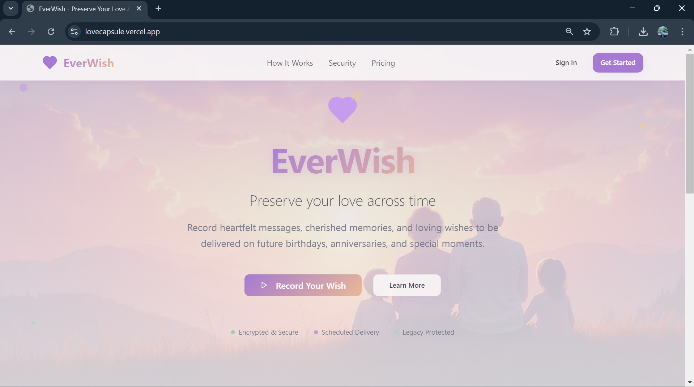
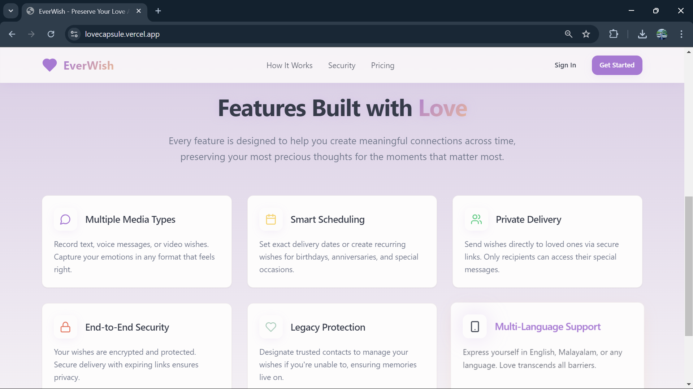
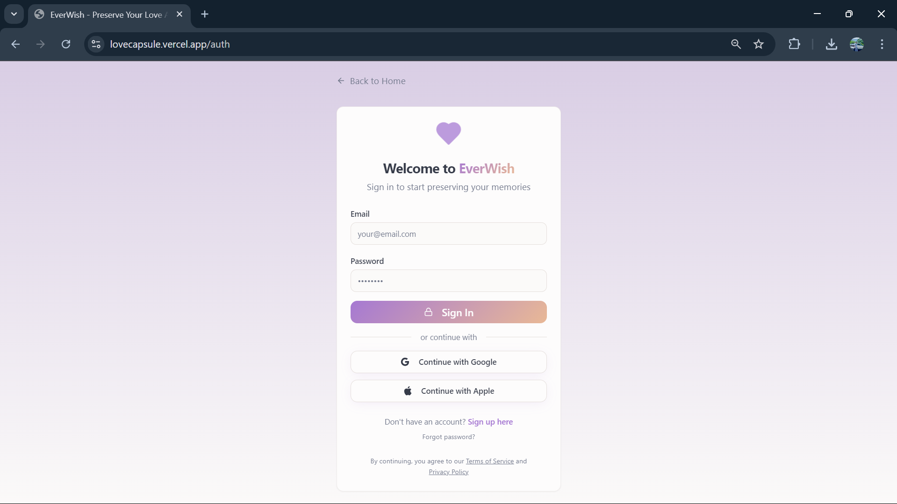
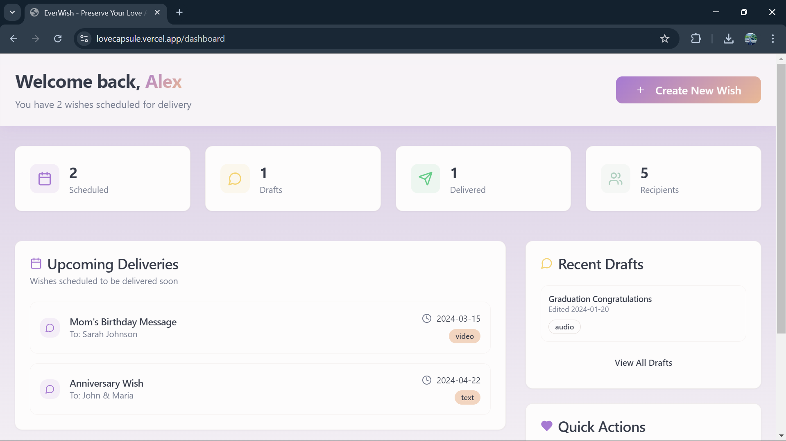
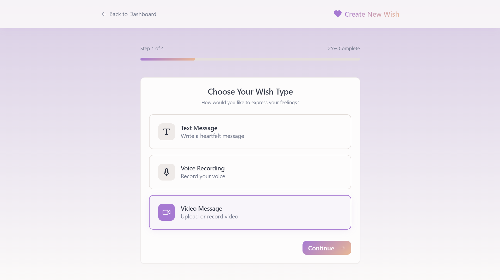
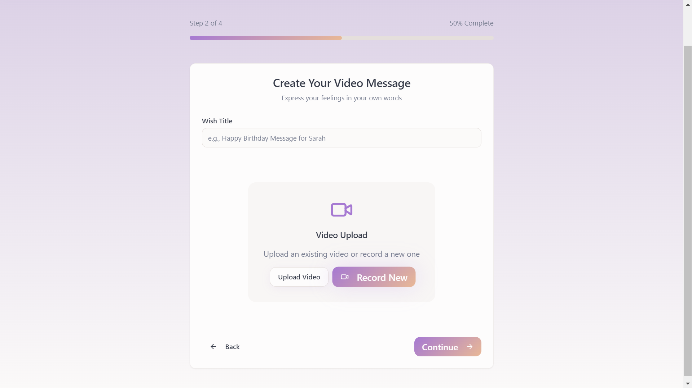
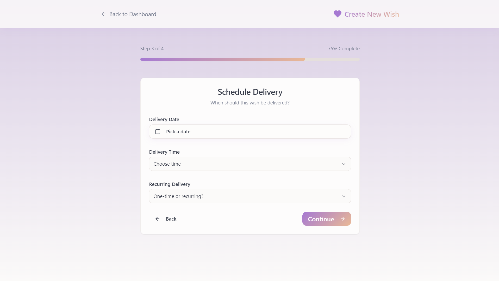
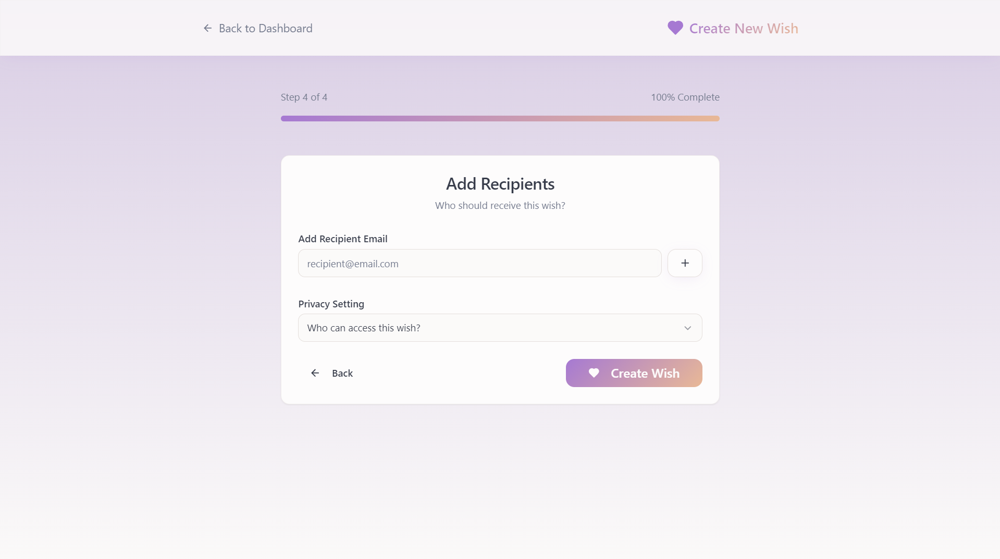

<h1 align="center">💌 LoveCapsule</h1>

  

  <b>Click the image above to try the Live Demo 🚀</b>

LoveCapsule is a web application that allows users to create and preserve digital wishes (text, voice, video) and schedule them for future delivery.  
It acts as a secure, long-term time capsule for personal messages, memories, and legacy communication.

[Live Demo](https://lovecapsule.vercel.app/)  

---

## 🚀 Features

- Multi-format wishes: text, audio, video  
- Schedule one-time or recurring deliveries  
- Manage recipients with email/SMS delivery  
- Encrypted storage for secure access  
- Notifications for delivered wishes  
- Legacy mode for trusted contacts  

---

## 🖥️ Screenshots

### Home Page
  

### Login Page

### Dashboard

### Create Wish
  
  
  

> Screenshots are in the `screenshots` folder. Replace with updated images if needed.

---

## 🛠️ Technology Stack

| Layer           | Technology                          |
|-----------------|------------------------------------|
| Frontend        | Next.js (React), Tailwind CSS       |
| Backend         | Node.js (Express/NestJS)           |
| Database        | PostgreSQL, Redis                   |
| Storage         | AWS S3 / GCP                        |
| Media Processing| FFmpeg                              |
| Auth            | JWT / OAuth (Google, GitHub)       |
| Notifications   | SendGrid (Email), Twilio (SMS)     |

---

